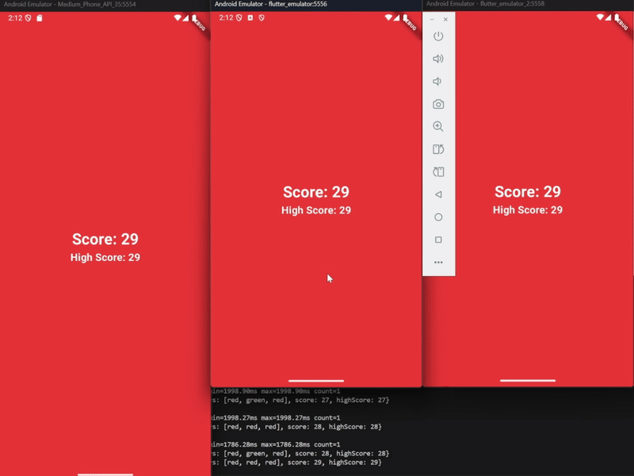

# Tech case 3: Whac-A-Mole

This is a Whac-A-Mole game built with Flutter and WebSocket, that is played with multiple devices where each one functions as a single button. The game state is synchronized across all connected clients.

## Features

- Real-time synchronization of the game.
- Each client acts as a button.
- More buttons get added/removed to the game as clients connect/disconnect.
- Randomly turns one button green every interval.
- Tracks and displays the score and high score.

## Demo



## Installation

### Prerequisites

- [Flutter SDK](https://flutter.dev/docs/get-started/install)
- [Node.js](https://nodejs.org/)

### Setup

1. Clone the repository:
   ```sh
   git clone https://github.com/bjornverbakel/whac-a-mole.git
   cd whac-a-mole
   ```

2. Install server dependencies:
   ```sh
   cd server
   npm install
   ```

3. Start the WebSocket server:
   ```sh
   node server.js
   ```

4. Run the Flutter app:
   ```sh
   cd ../lib
   flutter run
   ```

5. In case it cannot connect, update the WebSocket URL in main.dart and retry:
   ```sh
   _channel = IOWebSocketChannel.connect('ws://<your-server-ip>:4000');
    ```

## Usage

- Open the Flutter app on multiple devices or emulators.
- Tap the screen when a button turns green to earn points.
